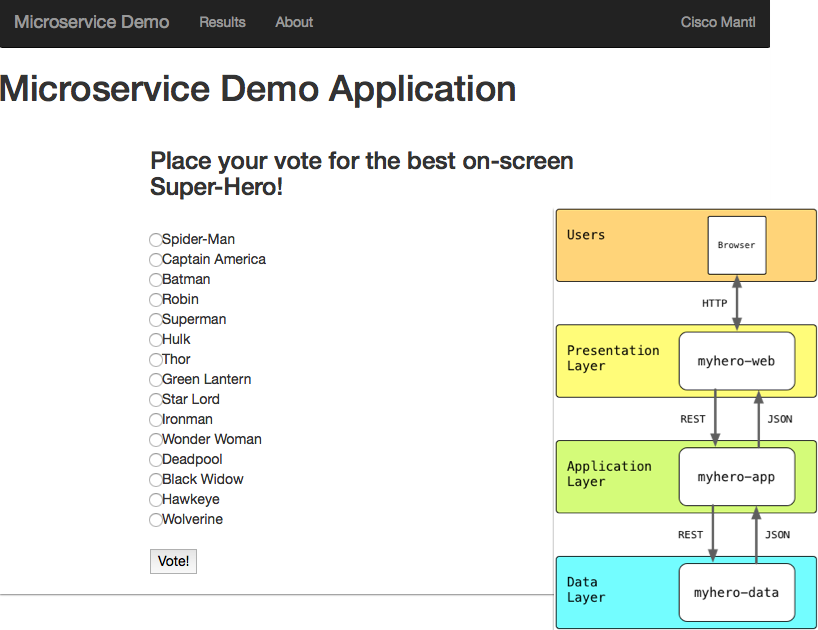

# Devnet Workshop - Mantl: How to use it.

This README is designed for Cisco Live "Devnet Workshop - Mantl: How to use it" DEVNET-2030 session. In this workshop you will learn how to deploy  micro-services applications and manage them on Cisco's Mantl platform. In this workshop we expect attendees have basic knowledge of containers, microservices architecture and REST APIs. This README is divided in following three sections.

1. Application Overview - This section talks about the "My Hero" application, architecture and micro-services used to compose the application.
2. Application Deployment - This section starts with Mantl UI walkthrough and covers application deployment on Mantl cluster.
3. Application Management - This section covers how to manage application life cycle using Mantl UI and REST APIs.

# 1 Application Overview

In this workshop we will be using "MyHero App" application which is being developed with microservices paradigm to demonstrate Mantl capabilities. MyHero App is a simple application which allow users to vote for their favorite super hero and gather the voting results. The application is built in a microservice style wrapping each service in a docker container that can be deployed and run on Mantl.  In its initial form the application has three services.

1. [myhero/data](https://github.com/hpreston/myhero_data) - This service stores all the data about candidates and votes cast.
2. [myhero/app](https://github.com/hpreston/myhero_app) - This service provides the basic logic layer for accessing and recording votes.
3. [myhero/web](https://github.com/hpreston/myhero_web) - This is the main user interface for casting votes.

# need to change the below content for postman users

# 2 Application Deployment

## 2.1 Prerequisites

Following are the prerequisites for the attendees to use the Postman collection.

- Google Chrome web browser.
- Google Chrome Postman extension. (https://www.getpostman.com/docs/introduction)

## 2.2 Mantl UI walkthrough

Open "https://mantlsandbox.cisco.com" on web browser and enter credentials as provided, this will open Mantl UI. On this page you will see different tiles for Mesos, Martahon, Consul and Traefik which are the core open source technologies used by Mantl. Please click on these  tiles one by one to explore these technologies.

#### Note: More information provide over workshop.   

## 2.3 Application deployment on Mantl

### 2.3.1 Import Mantl Postman collection on Chrome Postman application.

#### How:

Download following two files locally.

1. Environment File: https://github.com/CiscoCloud/clus-my-hero-app/blob/master/CLUS_MANTL.postman_environment.json
2. Mantl Collection File: https://github.com/CiscoCloud/clus-my-hero-app/blob/master/clus-my-hero-app.postman_collection.json

Open Postman application and import Environment and Collection files.

### 2.3.2 Update Environment variables

#### How:

Open Environment management tab from the postman UI and click on "CLUS_MANTL" Environment. Update modify the following environment variables as needed (Please consult Cisco engineers).

- MANTL_CONTROL: Mantl control API endpoint (####).
- MANTL_USER: Username to authenticate (####)
- MANTL_PASSWORD: Password to authenticate (#####)
- DEPLOYMENTNAME: Choose a name for your application (e.g. myHero1, heroVotingApp).
- MANTLDOMAIN: DNS name to access the deployed application (#####)

### 2.3.3 Deploy my-hero-app on Mantl

#### How:

On the Postman application go to "clus-my-hero-app > 1-myhero-install" folder and run (Send button) "1-install_myhero_data", "2-install_myhero_app" and "3-install_myhero_web" in order. This will install three micro services on Mantl cluster.

####Nate:
Go to Marathon UI to check if the services are deployed fully. Usually it takes couple of minutes to deploy.

### 2.3.4 Access the my-hero-app

You should be able to reach the web interface for the application at http://DEPLOYMENTNAME-web.YOUR-DOMAIN where DEPLOYMENTNAME refers to the deployment name provided at setup and YOUR-DOMAIN refers to the wildcard domain configured for Traefik.

#### Note:

Application URL was give at the environment setup step. It can also be found from the Traefik console.

# 3 Application Management

## 3.1 Mantl UI walkthrough with my-hero-app

Open "https://mantlsandbox.cisco.com" on web browser and enter credentials as provided, this will open Mantl UI. On this page you will see different tiles for Mesos, Martahon, Consul and Traefik which are the core open source technologies used by Mantl.

1. Click on the Mesos tile and look at the tasks, you will find tasks related to the application name you have give while setting up the environment.

2. Click on Marathon tile to open Marathon UI, here you can investigate individual services from the MyHero application. Click on the "Configuration" tab to explore about the service configuration. You can scale up/down the service from this tab as well.

####Note:
Please ask help from the Cisco engineers if needed.    

## 3.2 Using Mantl REST API

Mantl provide REST APIs to access its individual components (Mesos, Marathon etc...), REST APIs are good for integration purpose. To make this session easy we have created a bunch of postman collections under "2-app-management" folder.

### 3.2.1 List Applications

Run/Send "1-list_apps" to list the services you have just deployed. This will return response in JSON format.

### 3.2.2 Get Application details

Run/Send "2-get_myhero_web" command to get the details about "myhero_web" service. Look at the response there is only one instance ( "instances": 1) of the service is running.

### 3.2.3 Scale UP application

Currently there is only one instance ( "instances": 1) of the service is running for "myhero_web", to scale up this service open "5-sacle_up_myhero_web" REST request and open the "Body" tab from Postman request tab. Change the instances to 3 {"instances":3} and run/send the request. This will spin up 2 more instance of the "myhero_web" service. You can scale other service a neded.

### 3.2.4 Scale down application

To scale down the service open "6-sacle_down_myhero_web" postman request and change the instance to 1 ({"instances":1}) and run/send the request. This will bring down service "myhero_web" back to one.

## 3.3 Destroy MyHero Application

In this steps we will destroy the application along with all micro-services from the Mantl cluster.

####How:

Run/Send requests 1-uninstall_myhero_web, 2-uninstall_myhero_data and  3-uninstall_myhero_app from Postman folder "3-myhero-uninstall" to remove all three services from Marathon.

####Note:

You can verify the current state of services using 1-get_myhero_data, 2-get_myhero_app and 3-get_myhero_web REST requests or using the Mantl UI.
